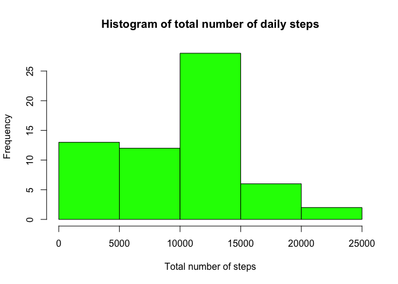
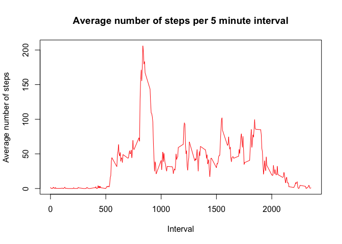
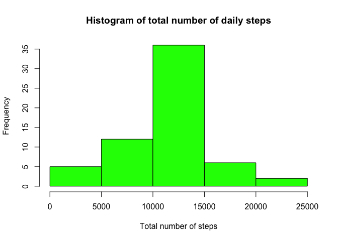
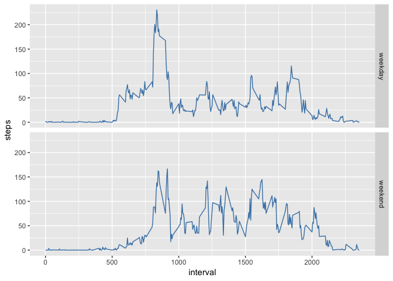

## Loading and preprocessing the data
For loading the data we assume that the *activity.zip* file is inside the working directory.  
We are going to load the libraries: dplyr, ggplot2.

```r
library(dplyr, quietly = TRUE)
```

```
## 
## Attaching package: 'dplyr'
```

```
## The following objects are masked from 'package:stats':
## 
##     filter, lag
```

```
## The following objects are masked from 'package:base':
## 
##     intersect, setdiff, setequal, union
```

```r
library(ggplot2, quietly = TRUE)
```
Also we will create a function to transform the time interval into time-formatted character.

```r
transf <- function(x) {paste(x %/% 100, x %% 100, sep = ":")}
```

Now loading the data and creating a new *timeinterval* column.

```r
myData <- read.table(unz("activity.zip","activity.csv"), header = TRUE, sep = ",", na.strings = "NA", colClasses = c("integer", "Date", "integer"))
myData$timeinterval <- transf(myData$interval)
```


## What is mean total number of steps taken per day?
1: Make a histogram of the total number of steps taken each day


```r
myDays <- group_by(myData, date)
myTotals <- summarise(myDays, steps = sum(steps, na.rm = TRUE))
hist(myTotals$steps, col = "green", xlab = "Total number of steps", main = "Histogram of total number of daily steps")
```

<!-- -->

2: The mean is **9354.2295082** and the median is **10395**.


## What is the average daily activity pattern?

1: Make a time series plot (i.e. type = "l") of the 5-minute interval (x-axis) and the average number of steps taken, averaged across all days (y-axis)

```r
myInterval <- group_by(myData, interval)
myAvg <- summarise(myInterval, steps = mean(steps, na.rm = TRUE))
plot(myAvg$interval, myAvg$steps, type = "l", xlab = "Interval", ylab = "Average number of steps", main = "Average number of steps per 5 minute interval", col = "red")
```

<!-- -->

2: The 5-minute interval, on average across all the days in the dataset, that contains the maximum number of steps is 8:35.


## Imputing missing values

The total number of rows with NA values is 2304.  
We will fill the NA values with average interval data. First, let's create the dataset with the average interval data column:


```r
myInterval <- group_by(myData, interval)
myInterval <- mutate(myInterval, average = mean(steps, na.rm = TRUE))
```

Then, create a new dataset *newData* equal to the original dataset but with the missing values filled in.

```r
newData <- myInterval
newData$steps[is.na(newData$steps)] <- newData$average[is.na(newData$steps)]
```

Let's make another histogram, this time with the new data:

```r
newDays <- group_by(newData, date)
newTotals <- summarise(newDays, steps = sum(steps))
hist(newTotals$steps, col = "green", xlab = "Total number of steps", main = "Histogram of total number of daily steps")
```

<!-- -->

As we can see, the data is now more uniform than before.
Also, the new mean (10766) and the new median (10766) of the total number of steps taken per day are different from the ones before since we have more data (NA values are replaced with positive values).


## Are there differences in activity patterns between weekdays and weekends?

In order to answer this question, there are a couple of steps involved.
1 - Create a new factor variable in the dataset with two levels – “weekday” and “weekend” indicating whether a given date is a weekday or weekend day. For this we create a function (wkdays) that we will use with sapply to create the variable.


```r
wkdays <- function(x) {
        val <- weekdays(x)
        if (val %in% c("Saturday", "Sunday")) {
                res <- "weekend"
        } else {
                res <- "weekday"
        }
        res
}
newData$wkdays <- as.factor(sapply(newData$date, wkdays))
```

2 - Make a panel plot containing a time series plot of the 5-minute interval (x-axis) and the average number of steps taken, averaged across all weekday days or weekend days (y-axis).


```r
myWkInterval <- group_by(newData, interval, wkdays)
myWkAvg <- summarize(myWkInterval, steps = mean(steps))

g <- ggplot(myWkAvg, aes(interval, steps))
g + geom_line(color = "steelblue") + facet_grid(wkdays ~ .)
```

<!-- -->

So, yes, it seems there is a difference with weekdays peaking at around 9 AM while weekends have more steps across the day.
